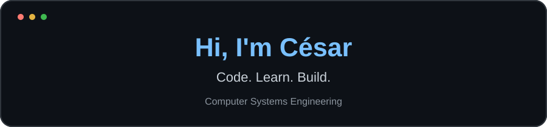

  

  

  <b>Computer Systems Engineering student</b> 
  Software development · Linux · Continuous learning

---

## About me

Hi! I'm **César López**, a Computer Systems Engineering student from Mexico.

- I enjoy building applications and learning how things work.
- I work with C#, Python, JavaScript and SQL.
- I'm currently learning JavaScript and React.
- I'm interested in software development, Linux and cybersecurity.

## Languages & tools

  

HTML · CSS · JavaScript · Python · C# · SQL (MySQL / SQL Server) Linux · Git · GitHub · VS Code · Visual Studio

## GitHub stats

  
  

## My contributions

  <picture>
    <source media="(prefers-color-scheme: dark)" srcset="https://raw.githubusercontent.com/CesarLopez-0124/CesarLopez-0124/output/github-contribution-grid-snake-dark.svg" />
    <source media="(prefers-color-scheme: light)" srcset="https://raw.githubusercontent.com/CesarLopez-0124/CesarLopez-0124/output/github-contribution-grid-snake.svg" />
    
  </picture>

---

   
  <b>Thanks for stopping by!</b> 
  One commit at a time.

